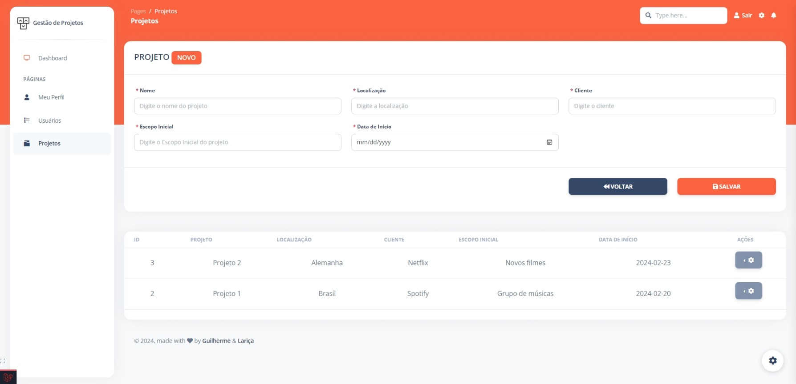

## Preview
 


[ ](https://github.com/guilhermehub12/gestao_de_projetos)

## Pré-requisitos

Se você ainda não possui um ambiente local com Apache ou outro tipo de servidor, sugiro instalar antes:

- PHP
- Composer (https://getcomposer.org/doc/00-intro.md)
- Laravel (https://laravel.com/docs/10.x/installation)
- Node
- Npm
- MySQL ou PostgreSQL

## Instalação
Clone o repositório para a sua máquina
```bash
Via Http: git clone https://github.com/guilhermehub12/gestao_de_projetos.git

Via SSH: git clone git@github.com:guilhermehub12/gestao_de_projetos.git
``` 

Conecte um banco local, coloque as credenciais no .env
```SQL
DB_CONNECTION=mysql
DB_HOST=127.0.0.1
DB_PORT=3306
DB_DATABASE=laravel
DB_USERNAME=root
DB_PASSWORD=
```

Instale as dependências
```bash
composer install && node install
```

Utilize `php artisan migrate:fresh --seed` Para criar a tabela de usuários básicos

## Uso
Registre um usuário ou login no usuário padrão **email@email.com** e senha **P@ssword** No seu banco de dados e comece a testar (certifique-se de executar as migrações e os seeders para que essas credenciais estejam disponíveis).

# Documentação

### Login
Se você não estiver conectado, só poderá acessar esta página ou a página de inscrição.O URL padrão leva você à página de login, onde você usa as credenciais padrão **email@email.com** com a senha **P@ssword**. O login é possível apenas com as credenciais já existentes.

O `App/Http/Controllers/Logincontroller.php` lida com o login de um usuário existente.

```bash
    public function login(Request $request)
    {
        $credentials = $request->validate([
            'email' => ['required', 'email'],
            'password' => ['required'],
        ]);

        if (Auth::attempt(['email' => $request->email, 'password' => $request->password])) {
            $request->session()->regenerate();

            return redirect()->intended('dashboard');
        }

        return back()->withErrors([
            'email' => 'As credenciais fornecidas não correspondem aos nossos registros.',
        ]);
    }
```

### Registrar
Você pode se registrar como usuário preenchendo o nome, e-mail e senha da sua conta. Você pode fazer isso acessando a página de inscrição a partir do botão "**Registrar**" na barra de navegação superior ou clicando no botão "**Registrar**" na parte inferior do formulário de login. Outra maneira é adicionar **/register** na url.

O `App/Http/Controllers/RegisterController.php` lida com o registro de um novo usuário.

```bash
    public function store()
    {
        $attributes = request()->validate([
            'username' => 'required|max:255|min:2',
            'email' => 'required|email|max:255|unique:users,email',
            'password' => 'required|min:5|max:255',
            'terms' => 'required'
        ]);
        $user = User::create($attributes);
        auth()->login($user);

        return redirect('/dashboard');
    }
```

### Esqueceu sua senha
Caso um usuário esqueça a senha da conta, é possível redefinir a senha. Para isso o usuário deverá clicar em "**aqui**" abaixo do formulário de login.

O `App/Http/Controllers/ResetPassword.php ` se encarrega de enviar um e-mail ao usuário onde ele poderá redefinir a senha posteriormente.

```bash
    public function send(Request $request)
    {
        $email = $request->validate([
            'email' => ['required']
        ]);
        $user = User::where('email', $email)->first();

        if ($user) {
            $this->notify(new ForgotPassword($user->id));
            return back()->with('succes', 'Um email foi enviado para o seu endereço de e-mail');
        }
    }
```

### Redefinir senha
O usuário que esqueceu a senha recebe um e-mail no endereço de e-mail da conta. O usuário pode acessar a página de redefinição de senha clicando no botão encontrado no e-mail. O link para redefinição de senha fica disponível por 12 horas. O usuário deverá adicionar o e-mail, a senha e confirmar a senha para que sua senha seja atualizada.

O `App/Http/Controllers/ChangePassword.php` ajuda o usuário a redefinir a senha.

```bash
    public function update(Request $request)
    {
        $attributes = $request->validate([
            'email' => ['required'],
            'password' => ['required', 'min:5'],
            'confirm-password' => ['same:password']
        ]);

        $existingUser = User::where('email', $attributes['email'])->first();
        if ($existingUser) {
            $existingUser->update([
                'password' => $attributes['password']
            ]);
            return redirect('login');
        } else {
            return back()->with('error', 'Seu email não corresponde ao e -mail que solicitou a alteração de senha');
        }
    }
```

### Perfil de usuário
O perfil pode ser acessado por um usuário logado clicando em "**Perfil**" na barra lateral ou adicionando **/perfil** na url. O usuário pode adicionar informações como número de telefone, localização, descrição ou alterar nome e email.

O `App/Http/Controllers/UserProfileController.php ` lida com as informações do perfil do usuário.

```bash
        auth()->user()->update([
            'username' => $request->get('username'),
            'firstname' => $request->get('firstname'),
            'lastname' => $request->get('lastname'),
            'email' => config('app.is_demo') ? auth()->user()->email : $request->get('email') ,
            'address' => $request->get('address'),
            'city' => $request->get('city'),
            'country' => $request->get('country'),
            'postal' => $request->get('postal'),
            'about' => $request->get('about')
        ]);
    
}
```

### Projetos
O projetos podem ser acessados por um usuário logado clicando em ***Projetos*** na barra lateral ou adicionando ***/projects*** na url. O usuario pode adicionar informações como nome do projeto, localização, cliente, escopo inicial e data de inicío.

O `App/Http/Controllers/ProjectController.php ` lida com as informações dos projetos desde a criação, edição, visualização e a exclusão.

```bash
public function index(Request $request)
    {
        $projects = $this->projectRepository->paginate(10, 'created_at', 'DESC', $request->except(['_token', 'page']));
        return view('pages.projects.index', [
            'projects' => $projects,
            'users' => $this->userRepository->selectOption(),
            'status' => $this->statusRepository->selectOption()
        ]);
    }

    /**
     * Show the form for creating a new resource.
     */
    public function create()
    {
        return view('pages.projects.create', [
            'users' => $this->userRepository->selectOption(),
            'status' => $this->statusRepository->selectOption()
        ]);
    }

    /**
     * Store a newly created resource in storage.
     */
    public function store(Request $request)
    {
        $result = $this->projectRepository->store($request->except(['_token']));

        if ($result === true) {
            flash()->success('Projeto cadastrado com sucesso!');
        } else {
            flash()->error("Erro ao cadastrar" . $result);
        }

        return redirect()->route('projects.index');
    }

    /**
     * Display the specified resource.
     */
    public function show(Project $project)
    {
        return view('pages.projects.show', [
            'project' => $project
        ]);
    }

    /**
     * Show the form for editing the specified resource.
     */
    public function edit(Project $project)
    {
        return view('pages.projects.edit', [
            'project' => $project,
            'users' => $this->userRepository->selectOption(),
            'status' => $this->statusRepository->selectOption()
        ]);
    }

    /**
     * Update the specified resource in storage.
     */
    public function update(Request $request, Project $project)
    {
        $result = $this->projectRepository->update($project, $request->except(['_token']));

        if ($result === true) {
            flash()->success('Projeto atualizado com sucesso!');
        } else {
            flash()->error("Erro ao atualizar" . $result);
        }

        return redirect()->route('projects.index');
    }

    /**
     * Remove the specified resource from storage.
     */
    public function destroy(Request $request, Project $project)
    {
        $result = $this->projectRepository->destroy($project);

        if ($result === true) {
            flash()->success('Projeto deletado com sucesso!');
        }

        return redirect()->route('projects.index');
    }
```

## Propriedades de bons projetos:

1. Integridade conceitual: Refere-se à consistência e coerência do design geral. No nosso sistema, todas as funcionalidades devem trabalhar em conjunto para atender ao objetivo principal de gerenciar projetos de construção civil.
2. Ocultamento de informação: Isso significa que os detalhes internos de uma parte do sistema são ocultados de outras partes. Por exemplo, a implementação de como os projetos são armazenados no banco de dados deve ser oculta dos gerentes de projeto.
3. Coesão: Refere-se a quão estreitamente todas as rotinas em um módulo estão relacionadas umas às outras. Por exemplo, todas as operações relacionadas ao gerenciamento de projetos (como adicionar, remover, consultar e alterar projetos) devem estar no mesmo módulo.
4. Acoplamento: Refere-se ao grau em que um módulo depende de outros módulos. Devemos minimizar o acoplamento para tornar o sistema mais modular e fácil de manter.

## Princípios de bons projetos:

### SOLID:
1. Single Responsibility Principle (SRP): Cada classe deve ter apenas uma responsabilidade. Por exemplo, poderíamos ter uma classe Project que lida apenas com operações de gerenciamento de projetos.
2. Open-Closed Principle (OCP): As entidades de software devem estar abertas para extensão, mas fechadas para modificação. Por exemplo, se quisermos adicionar uma nova funcionalidade para gerenciar tarefas do projeto, devemos ser capazes de fazer isso sem alterar a classe Project.
3. Liskov Substitution Principle (LSP): As subclasses devem ser substituíveis por suas classes base. Por exemplo, se tivermos uma classe LargeProject que herda da classe Project, qualquer instância de Project deve ser capaz de ser substituída por LargeProject sem afetar o comportamento do programa.
4. Interface Segregation Principle (ISP): Os clientes não devem ser forçados a depender de interfaces que não usam. Por exemplo, os gerentes de projeto que só precisam gerenciar projetos não devem ser forçados a depender de uma interface que inclui funcionalidades de gerenciamento de funcionários.
5. Dependency Inversion Principle (DIP): Os módulos de alto nível não devem depender de módulos de baixo nível. Ambos devem depender de abstrações. Por exemplo, a classe Project não deve depender diretamente do banco de dados (um detalhe de baixo nível), mas de uma interface abstrata, como ProjectRepository.
- Prefira Interfaces a Classes: Isso significa que é melhor depender de interfaces (abstrações) do que de classes concretas, pois isso torna o sistema mais flexível e menos acoplado. No nosso sistema, por exemplo, a classe Project deve depender de uma interface ProjectRepository em vez de uma classe concreta ProjectRepository.
- Lei de Demeter (LoD): Um objeto deve evitar invocar métodos de um objeto retornado por outro método. Isso leva a um acoplamento mais fraco. No nosso sistema, por exemplo, a classe Project não deve chamar um método do banco de dados através da classe Project.

## Créditos

***Guilherme Delmiro***
&
***Lariça Georgia***
